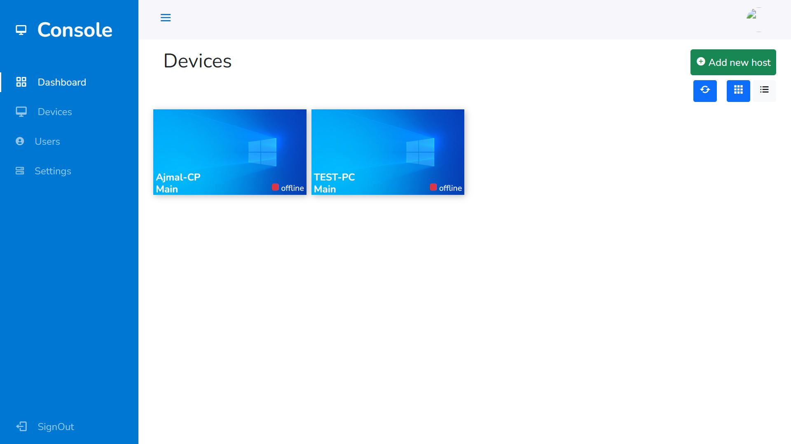
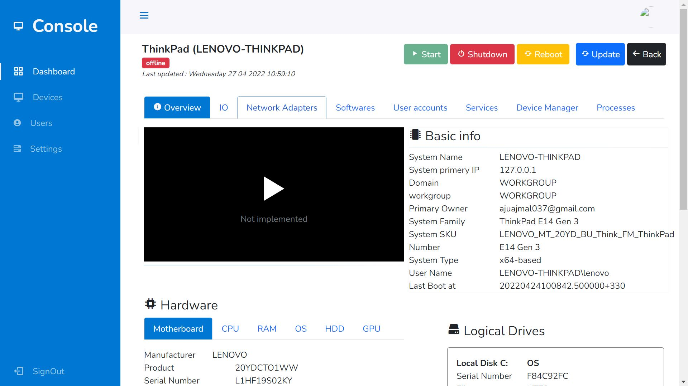
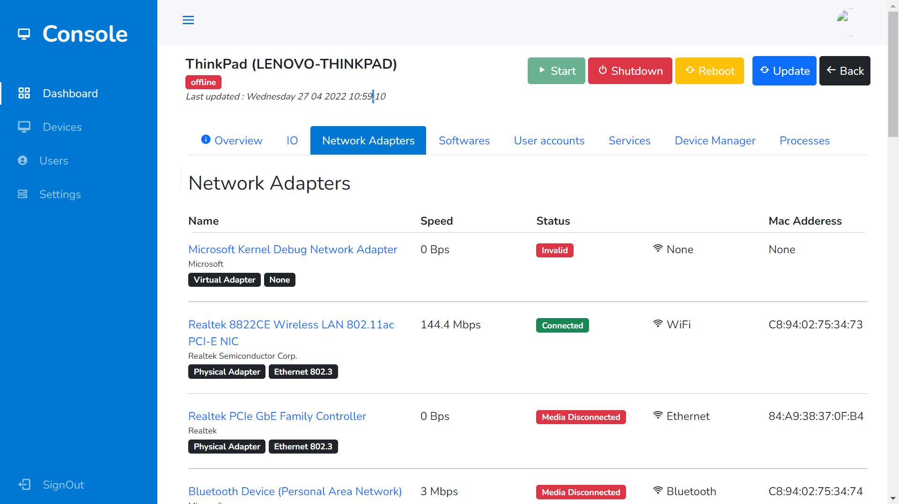
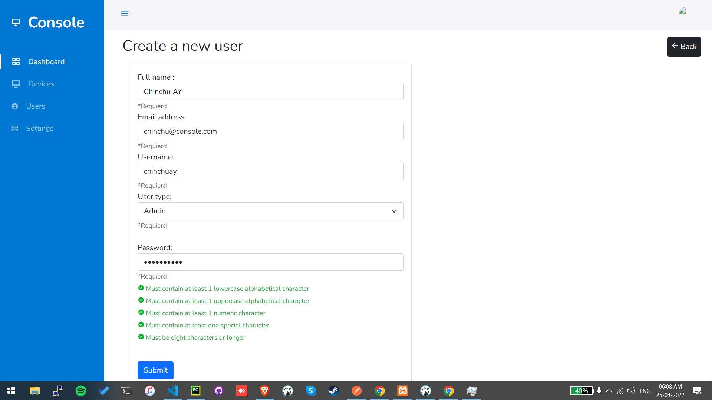
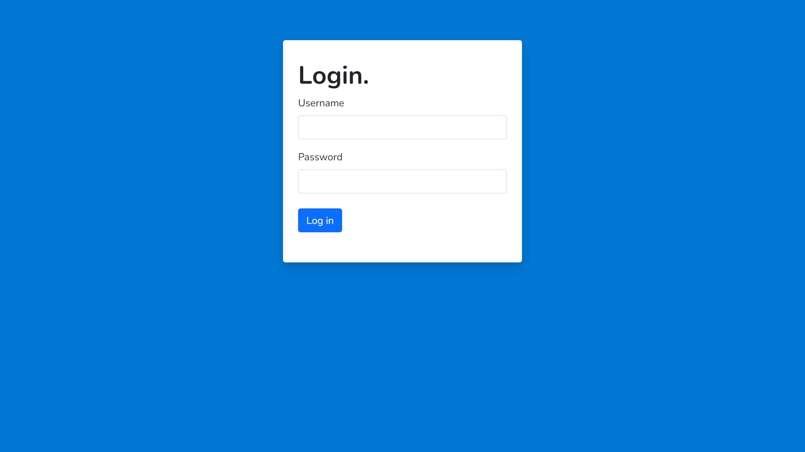

# RDMS Console

console is a web application.
This allows you to display the information stored in the database.
It also allows an IT administrator to control workstation computers.
Features of the console
user login, user registration
You can see the details of the workstation computer.
You can view the resource information of the workstation computer.
You can control the workstation computer.
<ul>
<li>It is made using PHP and Laravel framework</li>
<li>its working with help of rest api</li>
</ul>

The console has two modules
<ol>
<li>Admin</li>
<li>Gust</li>
</ol>

# Screenshots

# Demo

